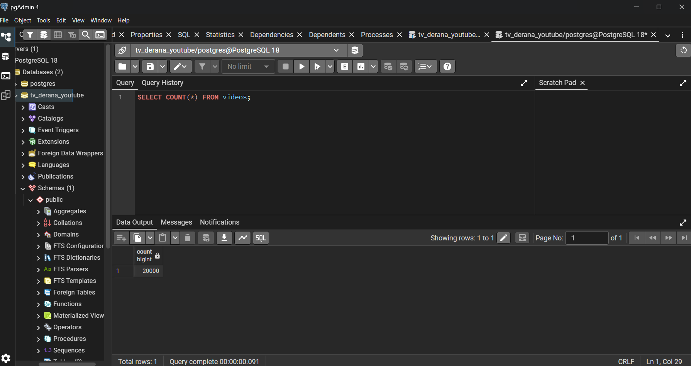
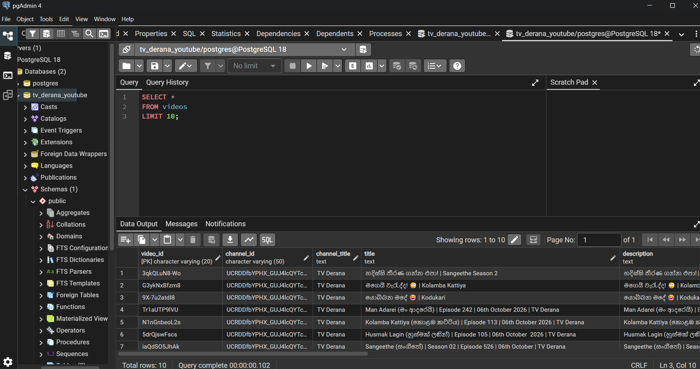
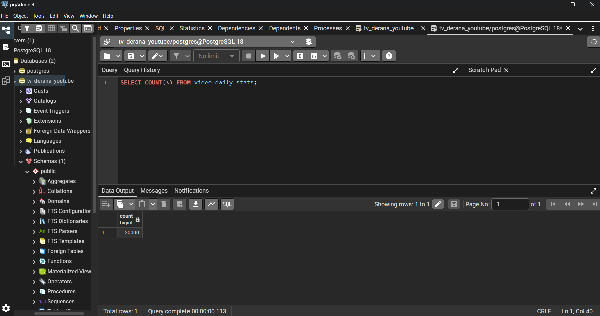
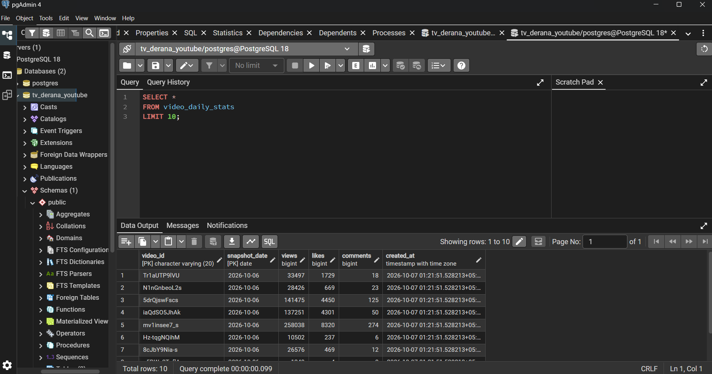
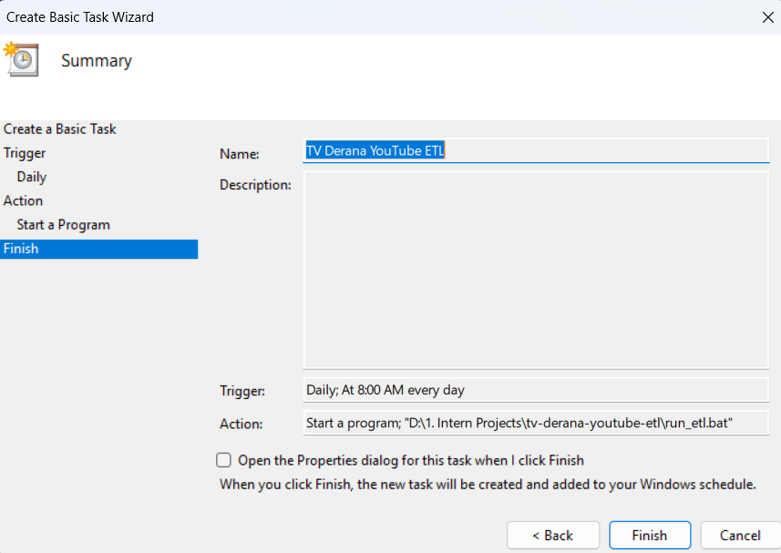

# TV Derana YouTube ETL

A Python-based ETL pipeline that retrieves TV Derana YouTube
video data using the YouTube Data API and stores historical
daily statistics in PostgreSQL.

## Objective

The objective is to create a secure and maintainable ETL
process for collecting TV Derana YouTube data on a daily basis.

## Technologies

- Python
- YouTube Data API v3
- PostgreSQL
- Git
- GitHub
- pytest
- Windows Task Scheduler

## Architecture

YouTube Data API
        ↓
    Extract
        ↓
    Transform
        ↓
      Load
        ↓
   PostgreSQL

## Features

- YouTube API integration
- Pagination handling
- Batch video retrieval
- Data transformation
- Data validation
- Historical daily snapshots
- PostgreSQL storage
- Duplicate prevention
- Logging
- Error handling
- Secure environment variables
- Automated daily execution
- Unit tests

## Project Structure

```text
src/
    config.py
    logger.py
    youtube_api.py
    extract.py
    transform.py
    database.py
    load.py
    main.py

tests/
docs/
logs/
```
## Setup

1. Clone the repository

```
git clone https://github.com/Bela2002/tv-derana-youtube-etl.git
cd tv-derana-youtube-etl
```

2. Create virtual environment

```
python -m venv .venv
```

   - Activate it on Windows:

   ```
   .venv\Scripts\activate
   ```

3. Install dependencies

```
pip install -r requirements.txt
```

4. Configure environment variables
   
   Create  `.env` from `.env.example`.
  
   Add:

    - YouTube API key
    - YouTube channel ID
    - PostgreSQL credentials

   Never commit `.env`.

5. Create PostgreSQL database
  
   Create:

   ```
   tv_derana_youtube
   ```

   The application creates the required tables automatically.

6. Run

```
python -m src.main
```

7. Run tests

```
pytest
```
## Security

API keys and database passwords are stored in `.env`.

The `.env` file is excluded from GitHub using `.gitignore`.

## Daily Execution

The pipeline can be executed daily using Windows Task Scheduler and the provided `run_etl.bat` script.

## Historical Data

Daily YouTube statistics are stored using:

```
video_id + snapshot_date
```

This allows changes in views, likes and comments to be analysed over time.

## Execution Evidence

The ETL pipeline was tested through both manual and scheduled execution.

### Manual Execution
- Python ETL executed successfully through the VS Code terminal.
- Extracted YouTube data was transformed and loaded into PostgreSQL.

.png>)

.png>)

### Database Validation
- PostgreSQL queries were used to verify the number of records and stored video data.









### Automated Execution
- Windows Task Scheduler was configured to execute the ETL pipeline daily at 8:00 AM.

